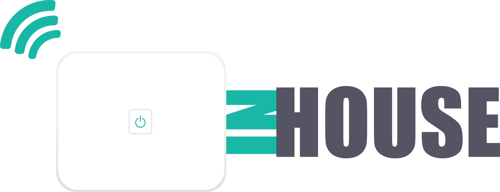
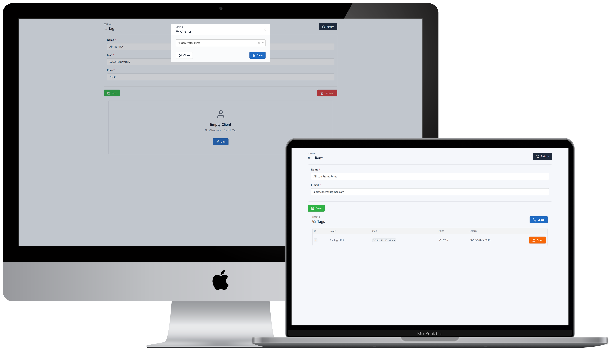



  

___

 

  <a href="#sobre">SOBRE</a>&nbsp;&nbsp;&nbsp;|&nbsp;&nbsp;&nbsp;<a href="#tecnologia">TECNOLOGIA</a>&nbsp;&nbsp;&nbsp;|&nbsp;&nbsp;&nbsp;<a href="#execute">EXECUTE</a>&nbsp;&nbsp;&nbsp;|&nbsp;&nbsp;&nbsp;<a href="#licença">LICENÇA</a>

 

  

## SOBRE

A **inhouse** é uma Aplicação desenvolvida para vincular Clientes às Tags IoT, com foco na gestão do aluguel por hora de uso e na precificação personalizada, de acordo com diferentes cenários de aplicação.

## TECNOLOGIA

  
<strong>Tooling</strong>

  <ul>
    <li><a href="https://www.postman.com/">Postman</a></li>
    <li><a href="https://code.visualstudio.com/">VSCode</a></li>
  </ul>

  
<strong>Database</strong>

  <ul>
    <li><a href="https://typeorm.io/">TypeORM</a></li>
    <li><a href="https://www.mysql.com/">MySQL</a></li>
  </ul>

  
<strong>Integration</strong>

  <ul>
    <li><a href="https://swagger.io/">Swagger</a></li> 
    <li><a href="https://www.docker.com/">Docker</a></li> 
  </ul>

  
<strong>Back-End</strong>

  <ul>
    <li><a href="https://www.typescriptlang.org/">Typescript</a></li>
    <li><a href="https://nestjs.com/">NestJS</a></li>
  </ul>

  
<strong>Front-End</strong>

  <ul>
    <li><a href="https://angular.dev/">Angular</a></li>
    <li><a href="https://tabler.io/">Tabler</a></li> 
  </ul>

## EXECUTE

    - Clonar este repositório

    Preparando o Container do Banco de Dados

    - Docker
      |- Executar o Comando: "docker pull 'mysql:latest'" para baixar a Imagem do Banco de Dados MYSQL
      |- Executar o Comando: "docker volume create inhouse_mysql_data" para criar o Volume do Container
      |- Executar o Comando: "docker run -d --name inhouse_mysql_core -p 3306:3306 -e MYSQL_ROOT_PASSWORD=DB_PASSWORD -v inhouse_mysql_data:/var/lib/mysql mysql" para criar o Container mapeando: Nome, Porta Interna:Externa, Senha, Volume:Diretório e Imagem
        >_ Executar o Comando: "CREATE DATABASE inhouse;" utilizando o DB Client (já que: "migration:run" não cria o DB por questões de segurança quanto à propriedade: "synchronize: true" do ORM)
    
    Preparando e executando a Aplicação

    - Acessar o Back-End: "./backend"
      |- Instalar as dependências com o Comando: "npm install --force"
      |- Implementar as Migrations com o Comando: "npm run migration:run"
        >_ Inicializar o Back-End com o Comando: "npm run start:dev"
    - Acessar o Front-End: "./frontend"
      |- Instalar as dependências com o Comando: "npm install --force"
      |- Acessar o arquivo: "./frontend/src/environments/environment.ts:1" e atualizar o Endereço de Conexão com a API
        >_ Inicializar o Front-End com o Comando: "ng serve --open"
        

## LICENÇA

Esse projeto está sob a **Licença MIT** veja o arquivo [LICENSE](https://github.com/alissonpratesperes/inhouse/blob/main/LICENSE) para mais detalhes

___

👨🏻‍💻&nbsp;with&nbsp;❤️
